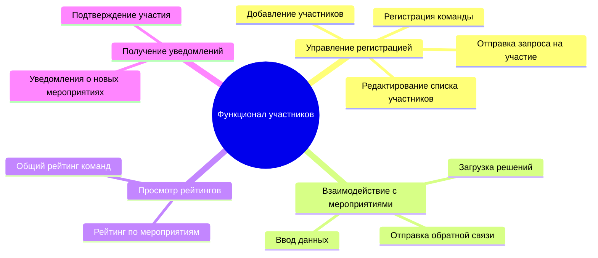
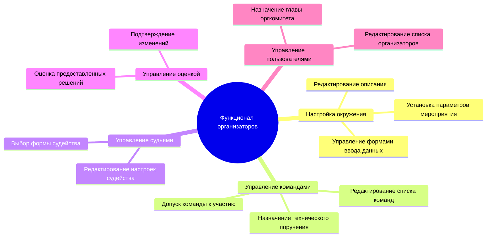
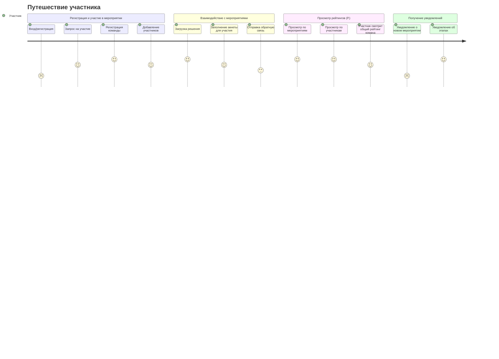
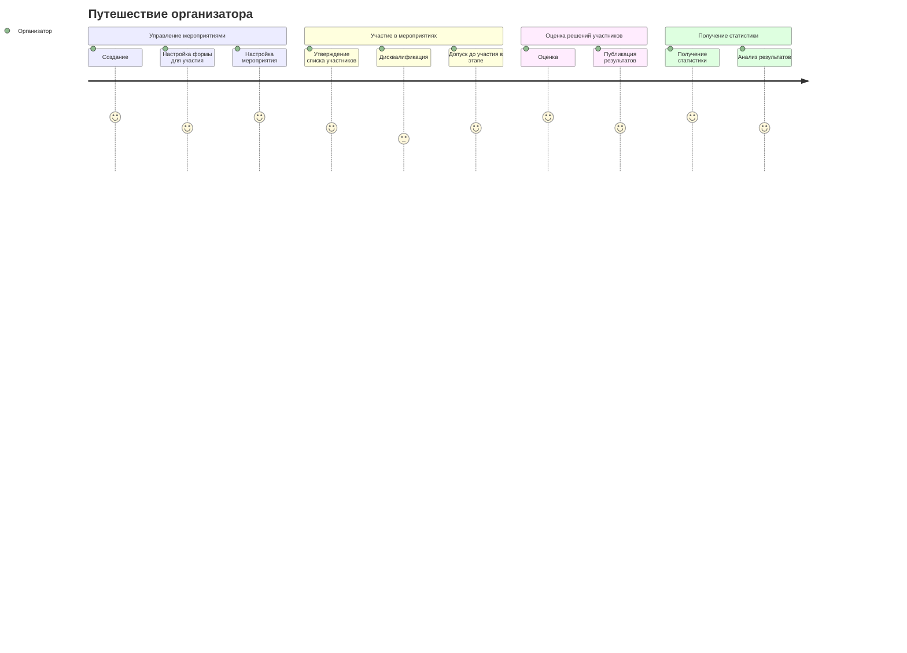
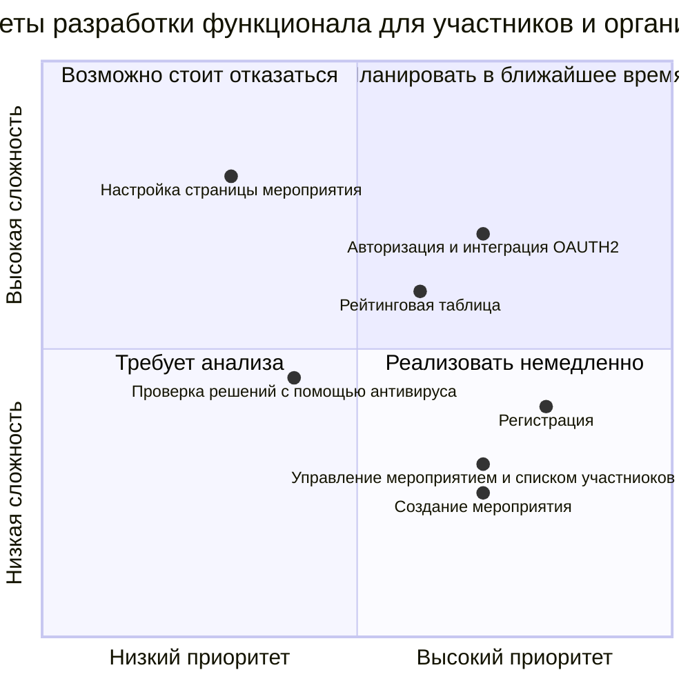
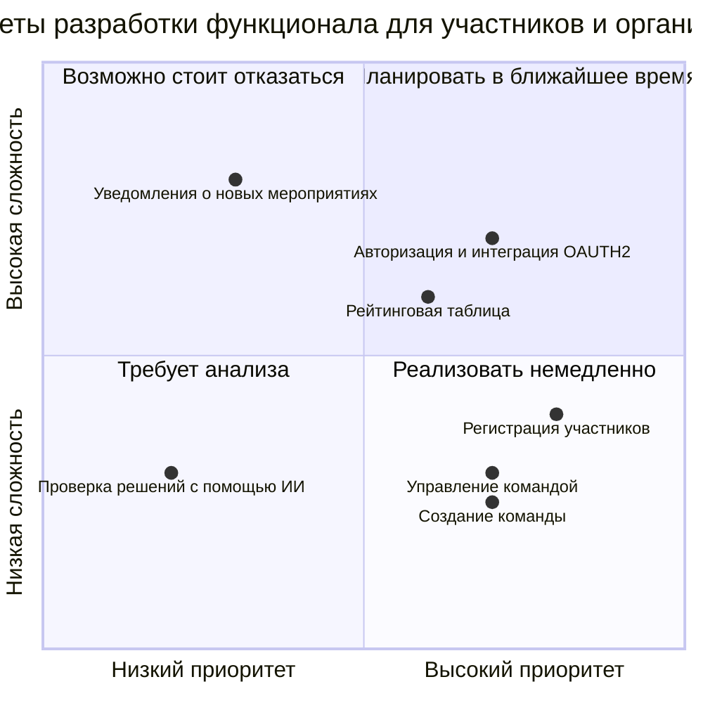
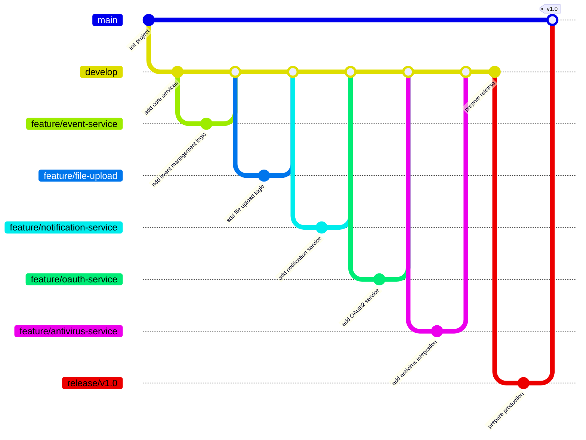

# Mindmap

```mermaid

mindmap
root((Функционал участников))
  Управление регистрацией
    Отправка запроса на участие
    Регистрация команды
    Добавление участников
    Редактирование списка участников
  Взаимодействие с мероприятиями
    Загрузка решений
    Ввод данных
    Отправка обратной связи
  Просмотр рейтингов
    Рейтинг по мероприятиям
    Общий рейтинг команд
  Получение уведомлений
    Уведомления о новых мероприятиях
    Подтверждение участия

```

```mermaid
mindmap
  root((Функционал организаторов))
    Настройка окружения
      Установка параметров мероприятия
      Редактирование описания
      Управление формами ввода данных
    Управление командами
      Редактирование списка команд
      Допуск команды к участию
      Назначение технического поручения
    Управление судьями
      Выбор формы судейства
      Редактирование настроек судейства
    Управление оценкой
      Оценка предоставленных решений
      Подтверждение изменений
    Управление пользователями
      Назначение главы оргкомитета
      Редактирование списка организаторов


```

### User Journey Diagram

```mermaid
journey
    title Путешествие участника
    section Регистрация и участие в мероприятии
      Вход/регистрация: 2: Участник
      Запрос на участие: 4: Участник
      Регистрация команды: 5: Участник
      Добавление участников: 4: Участник
    section Взаимодействие с мероприятиями
      Загрузка решения: 5: Участник
      Заполнение акнеты для участия: 4: Участник
      Отправка обратную связь: 3: Участник
    section Просмотр рейтингов (Р.)
      Просмотр по мероприятиям: 5: Участник
      Просмотр по участникам: 5: Участник      
      Участник смотрит общий рейтинг команд: 4: Участник
    section Получение уведомлений
      Уведомление о новом мероприятии: 2: Участник
      Уведомление об этапах: 5: Участник

```

```mermaid
journey
    title Путешествие организатора
    section Управление мероприятиями
      Создание: 5: Организатор
      Настройка формы для участия: 4: Организатор
      Настройка мероприятия: 5: Организатор
    section Участие в мероприятиях
      Утверждение списка участников: 4: Организатор
      Дисквалификация: 3: Организатор
      Допуск до участия в этапе: 4: Организатор
    section Оценка решений участников
      Оценка: 5: Организатор
      Публикация результатов: 4: Организатор
    section Получение статистики
      Получение статистики: 5: Организатор
      Анализ результатов: 4: Организатор

```

### 

```mermaid
quadrantChart
    title Приоритеты разработки функционала для участников и организаторов
    x-axis "Низкий приоритет" --> "Высокий приоритет"
    y-axis "Низкая сложность" --> "Высокая сложность"

    quadrant-1 "Планировать в ближайшее время"
    quadrant-2 "Возможно стоит отказаться"
    quadrant-3 "Требует анализа"
    quadrant-4 "Реализовать немедленно"


%% Организаторы
    "Настройка страницы мероприятия": [0.3, 0.8]
    "Авторизация и интеграция OAUTH2": [0.7, 0.7]
    "Рейтинговая таблица": [0.6, 0.6]
    "Создание мероприятия": [0.7, 0.25]
    "Управление мероприятием и списком участниоков": [0.7, 0.3]
    "Регистрация": [0.8, 0.4]
    "Проверка решений с помощью антивируса": [0.4, 0.45]
    
```

```mermaid
quadrantChart
    title Приоритеты разработки функционала для участников и организаторов
    x-axis "Низкий приоритет" --> "Высокий приоритет"
    y-axis "Низкая сложность" --> "Высокая сложность"

    quadrant-1 "Планировать в ближайшее время"
    quadrant-2 "Возможно стоит отказаться"
    quadrant-3 "Требует анализа"
    quadrant-4 "Реализовать немедленно"

%% Участники
    "Уведомления о новых мероприятиях": [0.3, 0.8]
    "Авторизация и интеграция OAUTH2": [0.7, 0.7]
    "Рейтинговая таблица": [0.6, 0.6]
    "Создание команды": [0.7, 0.25]
    "Управление командой": [0.7, 0.3]
    "Регистрация участников": [0.8, 0.4]
    "Проверка решений с помощью ИИ": [0.2, 0.3]
```

### ГИТ

```mermaid
gitGraph
   commit id: "init project"
   branch develop
   commit id: "add core services"
   branch feature/event-service
   commit id: "add event management logic"
   checkout develop
   merge feature/event-service
   branch feature/file-upload
   commit id: "add file upload logic"
   checkout develop
   merge feature/file-upload
   branch feature/notification-service
   commit id: "add notification service"
   checkout develop
   merge feature/notification-service
   branch feature/oauth-service
   commit id: "add OAuth2 service"
   checkout develop
   merge feature/oauth-service
   branch feature/antivirus-service
   commit id: "add antivirus integration"
   checkout develop
   merge feature/antivirus-service
   commit id: "prepare release"
   branch release/v1.0
   commit id: "prepare production"
   checkout main
   merge release/v1.0 tag: "v1.0"

```

